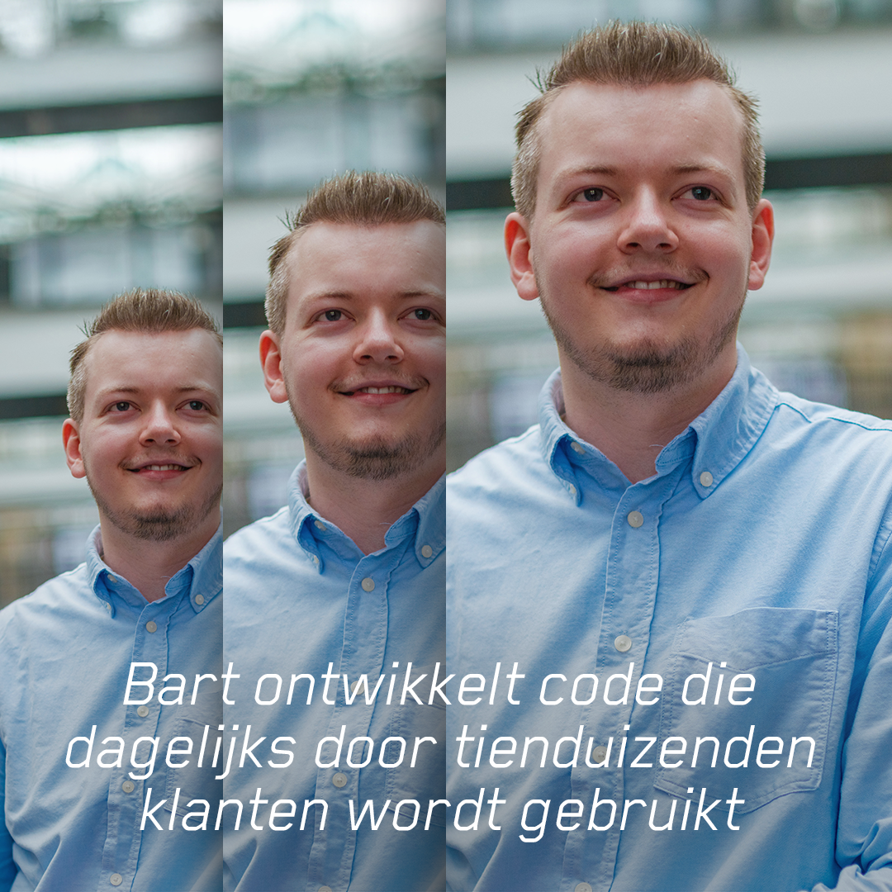

- Sinds september 2022 werk ik bij Achmea aan iOS-applicaties en platformoplossingen, met veel aandacht voor kwaliteit, onderhoudbaarheid en een goede gebruikerservaring.
- Technisch complexe trajecten opgepakt, zoals grote refactors, verbeteringen in chat- en deeplinkfunctionaliteit en het moderniseren van bestaande implementaties.
- Meegebouwd aan een design system en gedeelde componenten voor meerdere merken en teams, inclusief keuzes rondom architectuur, implementatie en tooling.
- Releases gedraaid, incidenten en hotfixes ondersteund en collega's geholpen bij debugging, logging en technisch uitdagende vraagstukken.
- Ontwikkelaars begeleid bij onboarding en implementaties, feedback gegeven en kennis gedeeld via demo's, presentaties en inhoudelijke afstemming.
- Veel samengewerkt met stakeholders en andere disciplines om technische keuzes toe te lichten, draagvlak te creëren en producten verder te brengen.

Foto uit de [_Ga ergens voor-campagne van Achmea_](https://www.werkenbijachmea.nl/update/dat-ik-nu-dagelijks-apps-bouw-voor-Achmea-voelt-soms-nog-steeds-onwerkelijk).